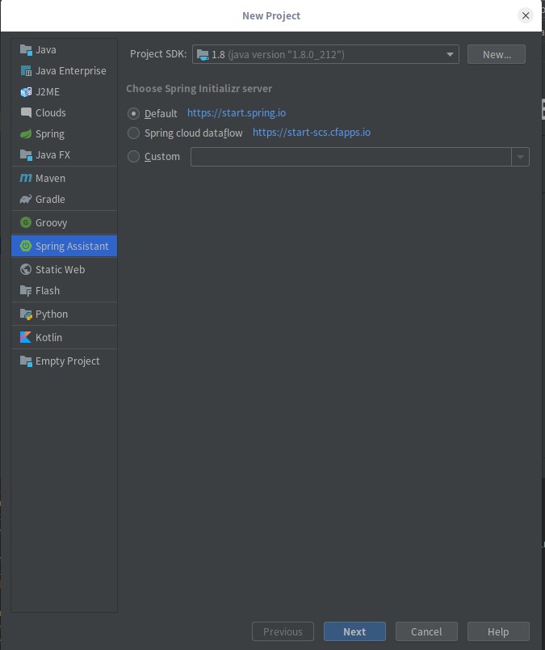
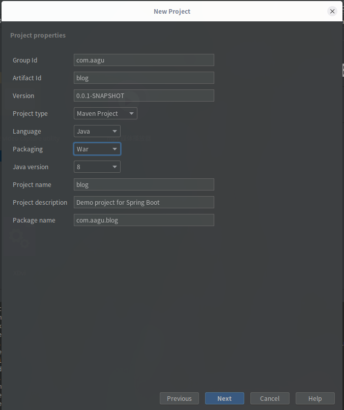
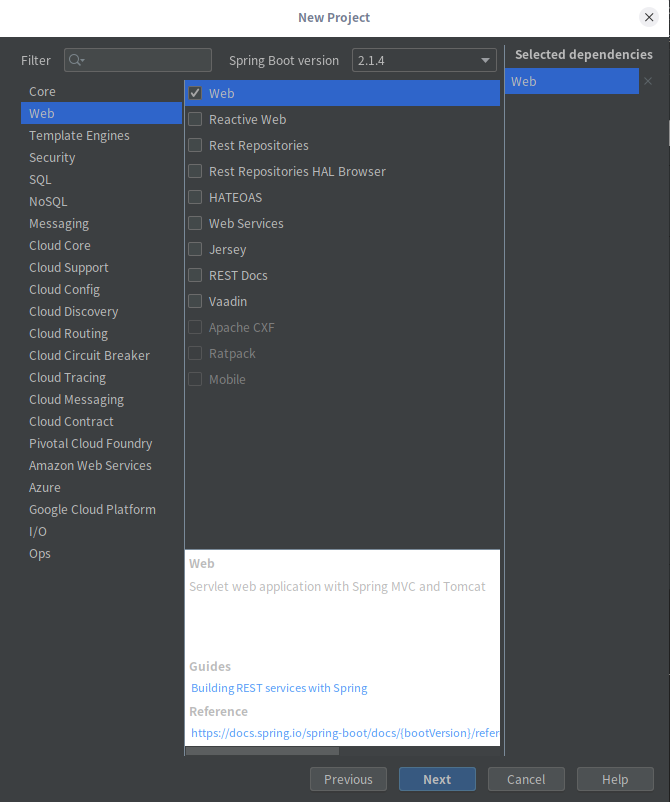
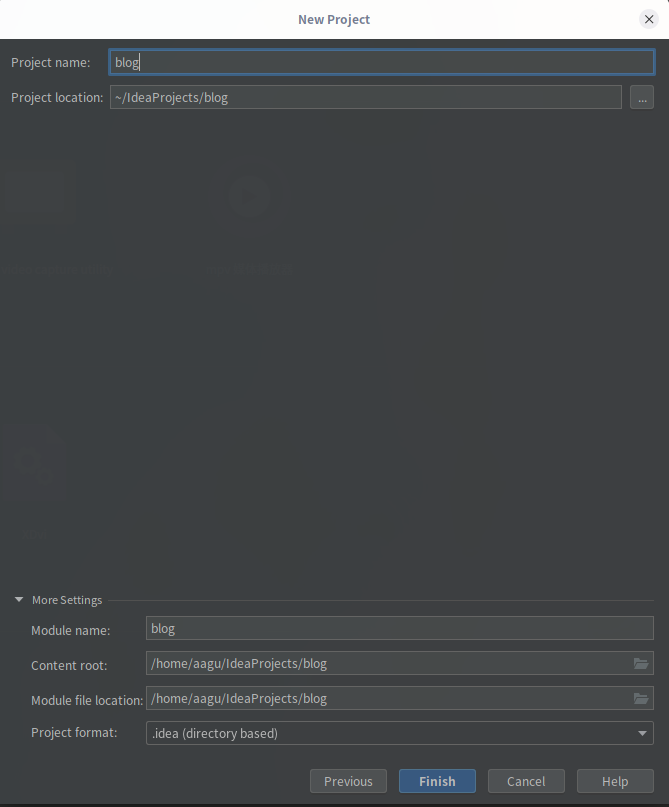
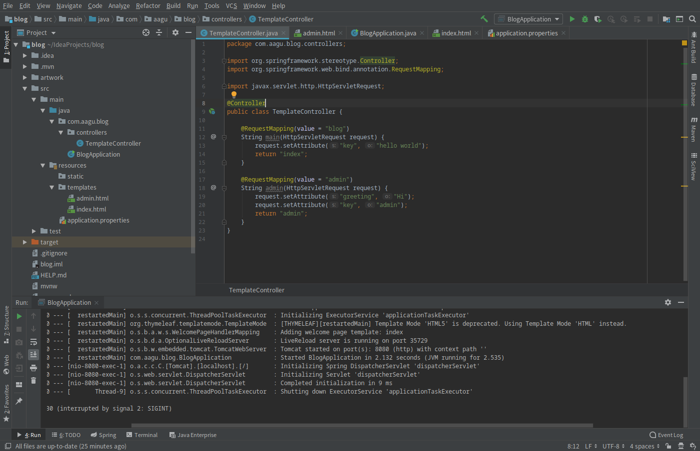
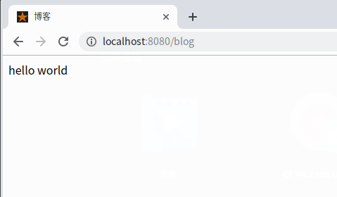
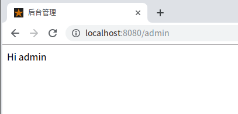

# 一步一步使用Spring Boot搭建博客系统
## day 1 初始化
### 新建项目
使用Spring Assistant建立Spring Boot Web项目



填入Group Id、Artifact Id、Project Name、Package Name


勾选Web


完成


建立如图项目结构


编辑```pom.xml```
加入以下内容
```XML
<dependency>
	<groupId>org.springframework.boot</groupId>
	<artifactId>spring-boot-devtools</artifactId>
	<optional>true</optional>
</dependency>
<dependency>
	<groupId>org.springframework.boot</groupId>
	<artifactId>spring-boot-starter-thymeleaf</artifactId>
</dependency>
```

##### 各文件内容
```TemplateController```
```Java
package com.aagu.blog.controllers;

import org.springframework.stereotype.Controller;
import org.springframework.web.bind.annotation.RequestMapping;

import javax.servlet.http.HttpServletRequest;

@Controller
public class TemplateController {

    @RequestMapping(value = "blog")
    String main(HttpServletRequest request) {
        request.setAttribute("key", "hello world");
        return "index";
    }

    @RequestMapping(value = "admin")
    String admin(HttpServletRequest request) {
        request.setAttribute("greeting", "Hi");
        request.setAttribute("key", "admin");
        return "admin";
    }
}
```

```BlogApplication```
```Java
package com.aagu.blog;

import org.springframework.boot.SpringApplication;
import org.springframework.boot.autoconfigure.SpringBootApplication;

@SpringBootApplication
public class BlogApplication {

	public static void main(String[] args) {
		SpringApplication.run(BlogApplication.class, args);
	}

}
```

```admin.html```
```HTML
<!DOCTYPE html>
<html lang="zh" xmlns:th="http://www.thymeleaf.org">
<head>
    <meta charset="UTF-8">
    <title>后台管理</title>
</head>
<body>
<span th:text="${greeting}"></span>
<span th:text="${key}"></span>
</body>
</html>
```

```index.html```
```HTML
<!DOCTYPE html>
<html lang="zh" xmlns:th="http://www.thymeleaf.org">
<head>
    <meta charset="UTF-8">
    <title>博客</title>
</head>
<body>
    <span th:text="${key}"></span>
</body>
</html>
```

```application.properties```
```
server.port=8080
spring.thymeleaf.cache=false
spring.thymeleaf.prefix=classpath:/templates/
spring.thymeleaf.check-template-location=true
spring.thymeleaf.suffix=.html
spring.thymeleaf.encoding=UTF-8
spring.thymeleaf.content-type=text/html
spring.thymeleaf.mode=HTML
```

打开```BlogApplication.java```，点击运行
输出如下：
```
com.aagu.blog.BlogApplication

  .   ____          _            __ _ _
 /\\ / ___'_ __ _ _(_)_ __  __ _ \ \ \ \
( ( )\___ | '_ | '_| | '_ \/ _` | \ \ \ \
 \\/  ___)| |_)| | | | | || (_| |  ) ) ) )
  '  |____| .__|_| |_|_| |_\__, | / / / /
 =========|_|==============|___/=/_/_/_/
 :: Spring Boot ::        (v2.1.4.RELEASE)
```

访问```localhost:8080/blog```和```localhost:8080/admin```


